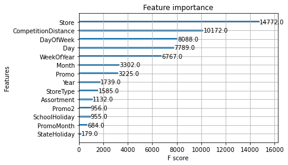
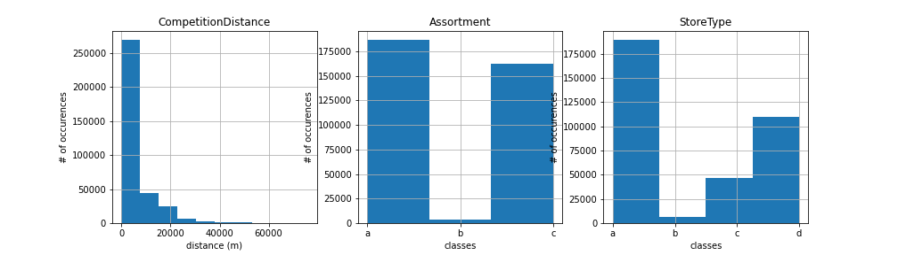

# DSR 29 mini-competition

## 1. Description

This mini competition is adapted from the [Kaggle Rossmann challenge](https://www.kaggle.com/c/rossmann-store-sales/overview).

**Goal**: Predict Sales of a given Rossmann store on a given day.

**Input**: train.csv and store.csv file. A description for the information contained in those files can be found on [Kaggle](https://www.kaggle.com/c/rossmann-store-sales/data ).

**Output**: submission.csv file from the holdout.csv file with two columns: (store) ID and Sales Prediction.

### Team members
Sina Rampe

Oskar Klaja

Aloïs Villa

## 2. Setup
1. From your terminal, clone the repository:

With SSH: `git clone git@github.com:alovg/DSR_minicomp.git`

With HTTPS: `git clone https://github.com/alovg/DSR_minicomp.git`

2. Compatible python version is 3.8.12

If you have jupyter notebook installed in your 'base' environment run:
`conda create -n minicomp python=3.8.12 pip ipykernel`

Otherwise: install jupyter notebook in miniconda environment with `pip3 install jupyter`

3. Get requirements by running `pip3 install -r requirements.txt`
4. Run file

    1. from the cloned repository in your terminal, run `jupyter notebook`
    2. navigate to _xgb_group1.ipynb_ in browser 
    3. Run all cells (from taskbar: go to run> run all cells)

6. You should now have a submission.csv file in the same folder.

## 3. Folder structure

Once cloned, the structure of the folder should look like:

> DSR_minicomp
>
> ├── data
>
> ├── development_files
> 
> ├── visualisations
> 
> ├── .gitignore
>
> ├── README.md
>
> ├── Requirements.txt
> 
> └── xgb_group1.ipynb

The data folder should look like:

> ├── holdout_b29.csv
> 
> ├── store.csv
>
> └── train.csv

## 4. Model description
### Model
The prediction was created using a Gradient Boosted Tree (with xgboost).

### Data Visualisation
For the data exploration, pandas profiling was used. The exported html profiles can be found in the visualisation folder.

### Features used
Existing features (used as is):

'DayOfWeek', 'SchoolHoliday', 'CompetitionDistance', 'Promo2', 'Open', 'Promo', 'Store'.

Existing features (encoded):

'Store_encoded', 'StoreType', 'Assortment', 'StateHoliday'.

Engineered features:

'Year', ‘Month’, ‘Day’, ‘WeekOfYear’, 'PromoMonth'.

### Scoring

On kaggle, this model was evaluated on the root mean square percentage error (RMSPE).

RMSPE = .164

### Other improvement attempts

The following are attempts which did not result in an improvement of the general performance of the model:

Models:
- Mean Lazy Estimator
- Linear Regression
- Random Forest Regression
- Tested Gradient Boosted Trees (xgBoost) parameters with validation set

Feature Engineering:
- one-hot encode all features
- target encode all features
- combination of the above two
- cyclic encoding with sinus and cosinus for DayOfWeek, day, month, year.
- upsampling store and assortment (see figures 1 and 2 below).
- imputing values for CompetitionDistance. 75km (maximum value for the feature) was set for the missing values (see figure 3 below).

